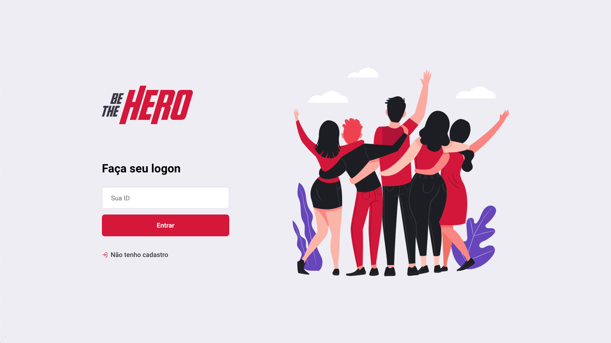
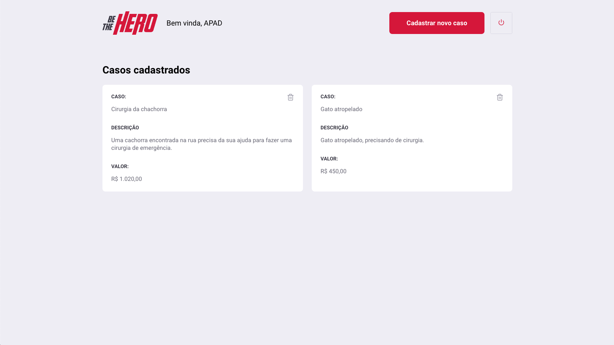
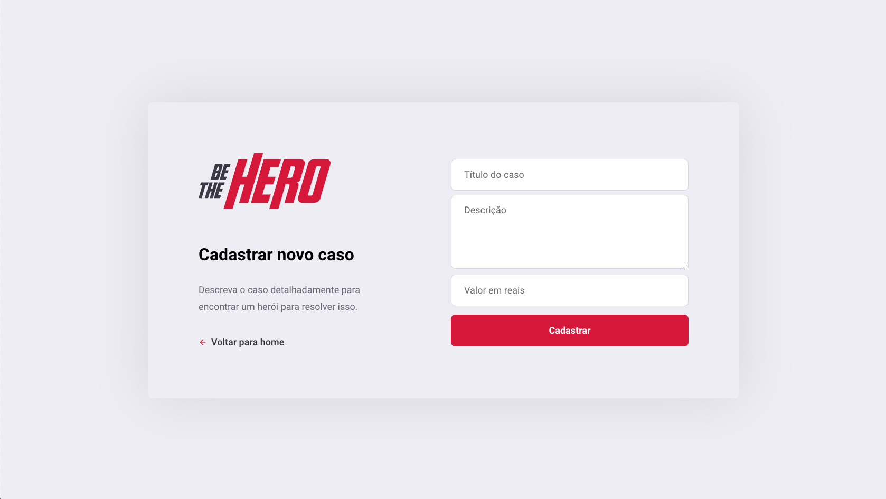
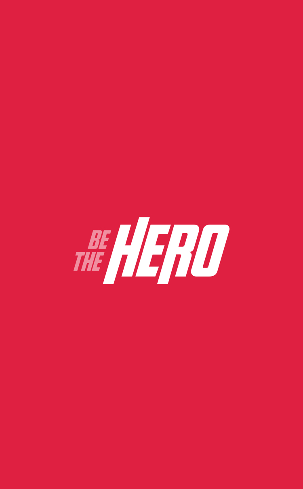
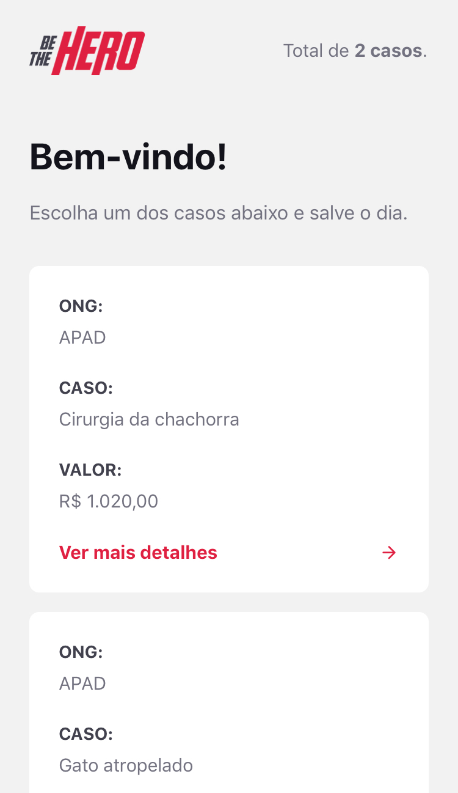
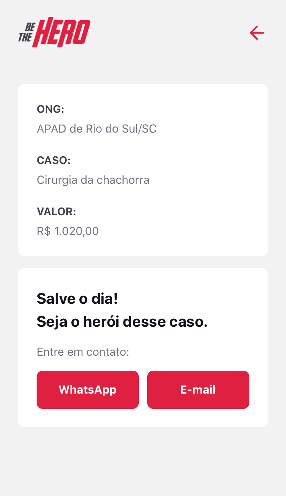

  

<h1 align="center">
  Be the hero
</h1>

> Open source application developed to help ONGs reach heroes for their cases.

Application developed following the week Omnistack 11 da [Rocketseat](https://rocketseat.com.br/).

## Table of Contents

- [Screenshots](#screenshots)
- [Technology](#technology)
  - [Backend](#backend)
  - [Frontend](#frontend)
  - [Mobile](#mobile)
- [Tools](tools)
- [Contribute](contribute)
- [License](license)

## Screenshots

Screenshots of the application both web and mobile.

> Screenshot login (Web)

> Screenshot list incidents (Web)

> Screenshot create incident (Web)

> Screenshot splash screen (Mobile)

> Screenshot list incidents (Mobile)

> Screenshot details incident (Mobile)

## Technology :construction:

### Backend :construction:

### Frontend :construction:

### Mobile :construction:

## Tools :construction:

## Contribute :construction:

## License :construction:
